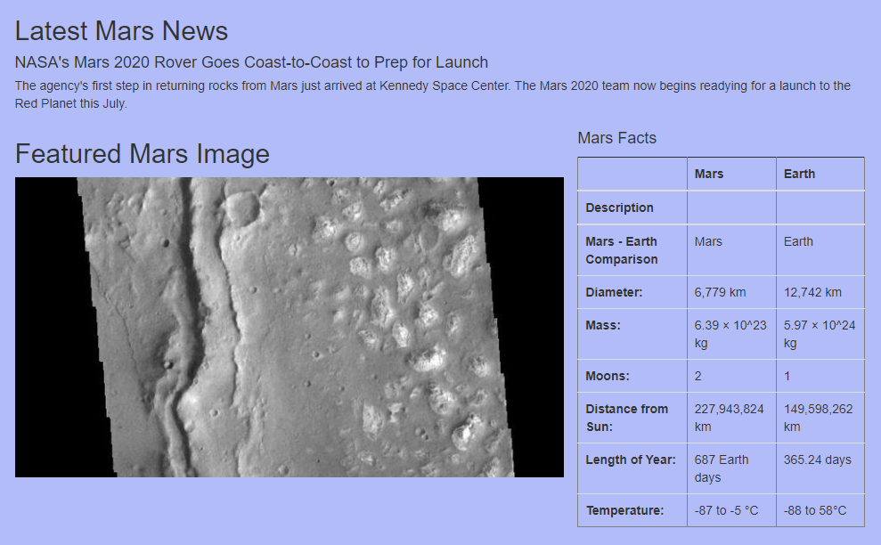
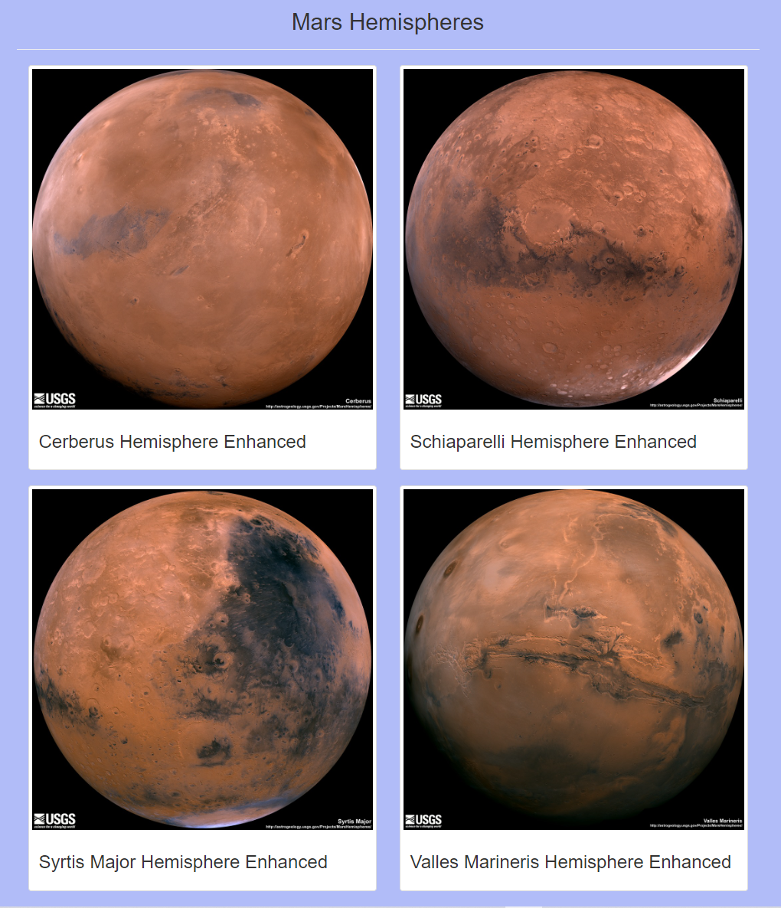

# Mission-to-Mars
Module 10

## Overview

This project developed a webscraping app about Mars that displays information from multiple sites.  It includes latest Mars news headline and teaser, a featured image, a table of Mars facts compared to Earth and Mars hemisphere images.

### Example of Output

